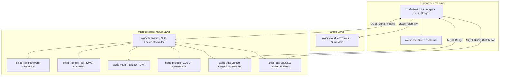

# 🏎️ Oxide Motive

[](https://www.rust-lang.org/)
[](LICENSE)
[](#getting-started)

**Oxide Motive** is a next-generation, high-performance, and modular Software-Defined Vehicle (SDV) platform built entirely in Rust. Designed to scale from bare-metal real-time microcontrollers (like the STM32H7 and NXP S32K) up to embedded edge gateways (Linux/Raspberry Pi) and cloud backend environments, Oxide Motive provides a unified and type-safe ecosystem for modern automotive systems.

---

## 🌐 System Architecture Overview

The platform is structured as a monolithic workspace containing several highly decoupled crates. Here is a high-level view of how they interact:



---

## 📦 Workspace Crates

The workspace is organized into separate crates for strict separation of concerns, optimized compilation boundaries, and maximizing code reuse across `no_std` (embedded) and `std` (host/cloud) targets:

| Crate | Target | Description | Key Technologies |
|---|---|---|---|
| **[`oxide-core`](file:///home/jrad/RustroverProjects/oxide-motive/oxide-core)** | `no_std` / `std` | Common data structures, telemetry schemas, and UDS enums. | `serde`, `postcard`, `heapless` |
| **[`oxide-protocol`](file:///home/jrad/RustroverProjects/oxide-motive/oxide-protocol)** | `no_std` / `std` | Zero-allocation COBS framing, messaging protocol, and PTP clock synchronization. | `cobs`, Kalman Filter |
| **[`oxide-hal`](file:///home/jrad/RustroverProjects/oxide-motive/oxide-hal)** | `no_std` / `std` | Unified Hardware Abstraction Layer for STM32, NXP, and mock execution environments. | Trait-based IO, Mocking |
| **[`oxide-firmware`](file:///home/jrad/RustroverProjects/oxide-motive/oxide-firmware)** | `no_std` (MCU) | The main RTIC real-time application doing crank trigger decoding & scheduling. | `rtic` v2.1, `cortex-m` |
| **[`oxide-control`](file:///home/jrad/RustroverProjects/oxide-motive/oxide-control)** | `no_std` | Classical and advanced automotive control loops (PID, Sliding Mode Control, Autotuning). | Limit Cycle Analysis |
| **[`oxide-math`](file:///home/jrad/RustroverProjects/oxide-motive/oxide-math)** | `no_std` | 3D Lookup Tables (trilinear/bilinear interpolation) and Unscented Kalman Filters (UKF). | `nalgebra` |
| **[`oxide-host`](file:///home/jrad/RustroverProjects/oxide-motive/oxide-host)** | `std` (Linux) | Host daemon driving communications, file logging, and Slint display HMI. | `tokio`, `serialport`, `chrono` |
| **[`oxide-hmi`](file:///home/jrad/RustroverProjects/oxide-motive/oxide-hmi)** | `std` / `no_std` | Desktop and embedded Slint UI update engine. | `slint` v1.5 |
| **[`oxide-uds`](file:///home/jrad/RustroverProjects/oxide-motive/oxide-uds)** | `no_std` (Embassy) | Unified Diagnostic Services (UDS) server interface run as async tasks. | `embassy-executor` |
| **[`oxide-ota`](file:///home/jrad/RustroverProjects/oxide-motive/oxide-ota)** | `no_std` (ESP32) | Cryptographically signed Over-The-Air update tasks. | `ed25519-dalek`, `esp-idf-svc` |
| **[`oxide-telemetry`](file:///home/jrad/RustroverProjects/oxide-motive/oxide-telemetry)** | `no_std` | Telemetry bridging pipeline between UART (COBS) and MQTT. | `serde_json_core` |
| **[`oxide-esp32-host`](file:///home/jrad/RustroverProjects/oxide-motive/oxide-esp32-host)** | `no_std` (ESP32) | ESP32-specific MQTT/WiFi client. | `esp-idf-hal` |
| **[`oxide-cloud`](file:///home/jrad/RustroverProjects/oxide-motive/oxide-cloud)** | `std` (Server) | High-performance telemetry ingestion REST API. | `actix-web`, `surrealdb` |

---

## 🚀 Getting Started

### Prerequisites

To build and compile the workspace, make sure you have the Rust toolchain installed:

```bash
rustup update stable
# For embedded targets (e.g. STM32H7):
rustup target add thumbv7em-none-eabihf
```

### Building the Entire Workspace

To build all crates in the workspace that are compatible with your host compiler:

```bash
cargo build --workspace
```

### Running the Host Platform

To launch the host supervisor daemon:

```bash
cargo run --bin oxide-host
```

### Running the Telemetry Cloud Ingestion API

To boot up the telemetry microservice backend:

1. Ensure [SurrealDB](https://surrealdb.com/) is running on port `8000`.
2. Launch the Actix server:

```bash
cargo run --bin oxide-cloud
```

---

## 📖 Additional Documentation

For a deep dive into design specifics, protocols, and control architecture, check out:

*   📄 **[`architecture.md`](file:///home/jrad/RustroverProjects/oxide-motive/architecture.md)**: Details engine schedulers, filters, diagnostic pipelines, and control loops.
*   📊 **[`diagram.md`](file:///home/jrad/RustroverProjects/oxide-motive/diagram.md)**: Visualizes call sequences, interrupt patterns, and data flow paths.
*   📘 **[`docs/book.toml`](file:///home/jrad/RustroverProjects/oxide-motive/docs/book.toml)**: Project configuration for the official mdBook documentation.

---

## ⚖️ License

Licensed under the Apache License, Version 2.0. See the [LICENSE](LICENSE) file for more information.
