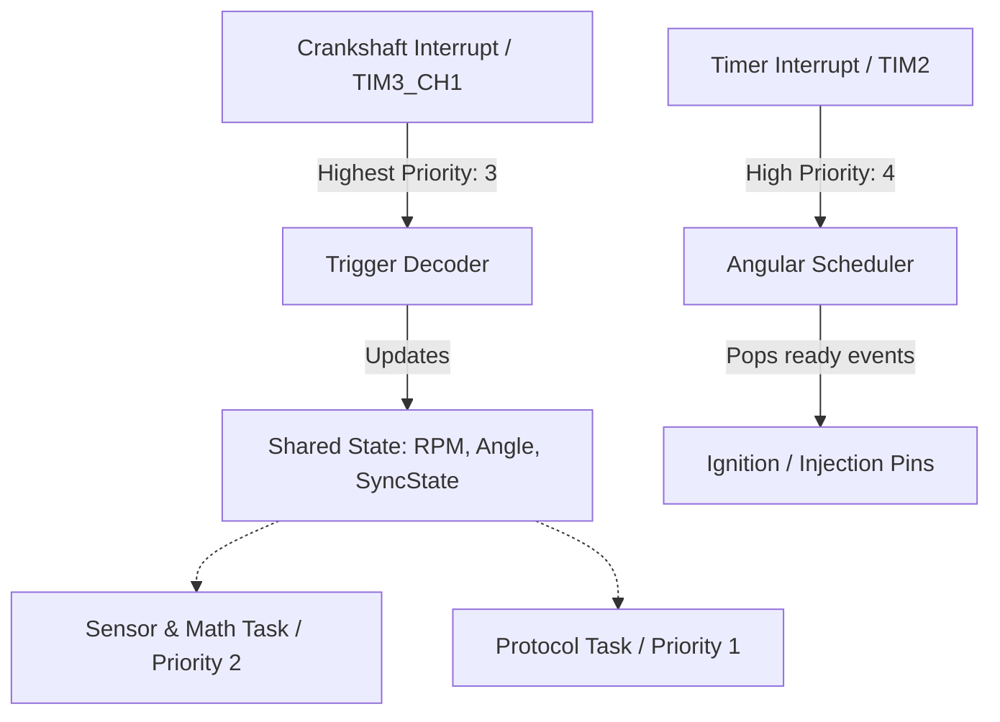
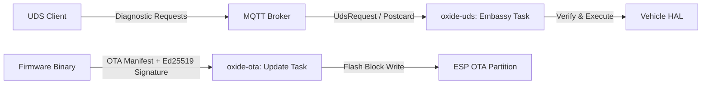

# 🏛️ Oxide Motive Architecture Specification

This document provides a detailed breakdown of the technical components, software architectures, algorithms, and design choices within the **Oxide Motive** Software-Defined Vehicle (SDV) platform.

---

## 1. Architectural Principles

Oxide Motive is designed to address the challenges of modern automotive computing by adhering to three core principles:
1. **Safety & Predictability**: Zero-allocation at runtime, static memory management (using `heapless` structures), and compile-time concurrency checking via RTIC.
2. **Hardware Agnosticism**: Separation of hardware logic and application logic via a generic Hardware Abstraction Layer (`oxide-hal`).
3. **End-to-End Type Safety**: Telemetry schemas, Unified Diagnostic Services (UDS) enums, and host/ECU messaging share a single source of truth in Rust.

---

## 2. Real-Time Execution Framework (`oxide-firmware`)

The core execution environment utilizes **RTIC (Real-Time Interrupt Control) v2.1** for scheduling tasks with strict hardware priorities. 

### 2.1 Trigger Decoder & Crank Synchronization
*   Located in [`trigger_decoder.rs`](file:///home/jrad/RustroverProjects/oxide-motive/oxide-firmware/src/trigger_decoder.rs).
*   Monitors Crankshaft Position Sensor edge interrupts on high-priority timers.
*   Determines engine RPM and absolute rotational angle.
*   Transitions the engine state through `SyncState` (e.g., `NoSignal`, `Syncing`, `FullySynchronized`).

### 2.2 Angular Scheduler
*   Located in [`scheduler.rs`](file:///home/jrad/RustroverProjects/oxide-motive/oxide-firmware/src/scheduler.rs).
*   Maps time-based hardware timers to angular domains (crank angle degrees).
*   Pops angular events (e.g., ignition dwell start/stop, fuel injection pulse width) dynamically as the crankshaft turns.

---

## 3. Communication & Protocol Stack (`oxide-protocol` & `oxide-telemetry`)

Communication between host gateway (Linux) and target MCU uses a packet-oriented serial bridge.

### 3.1 Consistent Overhead Byte Stuffing (COBS)
*   Located in [`framing.rs`](file:///home/jrad/RustroverProjects/oxide-motive/oxide-protocol/src/framing.rs).
*   Enforces zero-byte termination framing. Packets are encoded so that they contain no `0x00` bytes except at the boundary, ensuring clean framing and synchronization.
*   Implemented with zero-allocation buffers.

### 3.2 Time Synchronization & Kalman Filter
*   Located in [`clock_sync.rs`](file:///home/jrad/RustroverProjects/oxide-motive/oxide-protocol/src/clock_sync.rs).
*   Synchronizes the local MCU system clock with the host system clock using a 4-way Network Time Handshake (origin, receive, transmit, and response timestamps).
*   A **Kalman Filter** smooths out jitter caused by transport latencies:
    *   **State**: Clock Offset ($ns$), Clock Skew ($ppm$)
    *   **Measurement**: Raw offset calculated via asymmetric delay models.
    *   **Update**: Updates estimation error covariance to output stabilized timestamps.

---

## 4. Control Loops & Mathematics (`oxide-control` & `oxide-math`)

### 4.1 Lookup Tables (`Table3D`)
*   Located in [`lib.rs`](file:///home/jrad/RustroverProjects/oxide-motive/oxide-math/src/lib.rs).
*   Provides 3-dimensional data mapping (e.g., Volumetric Efficiency maps or Spark Advance angle mapping across RPM vs Engine Load).
*   Computes interpolation values at runtime using bilinear/trilinear algorithms.

### 4.2 Estimation (`UnscentedKalmanFilter`)
*   Located in [`ukf.rs`](file:///home/jrad/RustroverProjects/oxide-motive/oxide-math/src/estimation/ukf.rs).
*   An Unscented Kalman Filter (UKF) uses sigma points to capture non-linearities in vehicle dynamics (e.g., wheel slip or battery state of charge), avoiding linearization errors common in Extended Kalman Filters.

### 4.3 Control Loops
*   Located in [`oxide-control`](file:///home/jrad/RustroverProjects/oxide-motive/oxide-control).
*   **PID**: Classic Proportional-Integral-Derivative controller for idling speed and throttle adjustments.
*   **SMC (Sliding Mode Control)**: Robust control algorithm dealing with parameter uncertainties and external disturbances.
*   **Autotuner**: Tunes control loops dynamically on-board using limit cycle oscillations.

---

## 5. Security & Gateway Services (`oxide-uds`, `oxide-ota`, `oxide-cloud`)

### 5.1 Unified Diagnostic Services (UDS)
*   Located in [`oxide-uds`](file:///home/jrad/RustroverProjects/oxide-motive/oxide-uds).
*   An async Embassy task listening for `UdsRequest` commands.
*   Enables reading data registers (identifying sensors) and diagnostic session state control.

### 5.2 Over-The-Air (OTA) Updates
*   Located in [`oxide-ota`](file:///home/jrad/RustroverProjects/oxide-motive/oxide-ota).
*   Downloads binary payloads in chunks.
*   Performs cryptographical verification using `ed25519-dalek` to validate the image signature before triggering partition swaps and system resets.

### 5.3 Telemetry Cloud Ingestion
*   Located in [`oxide-cloud`](file:///home/jrad/RustroverProjects/oxide-motive/oxide-cloud).
*   Actix-Web REST microservice designed to ingest stream telemetry arrays.
*   Persists telemetry directly in SurrealDB, indexed by Vehicle Identification Number (VIN) and timestamp.
