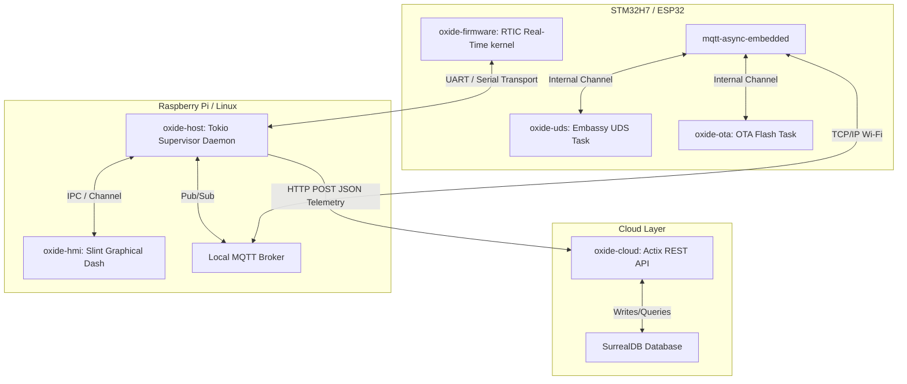
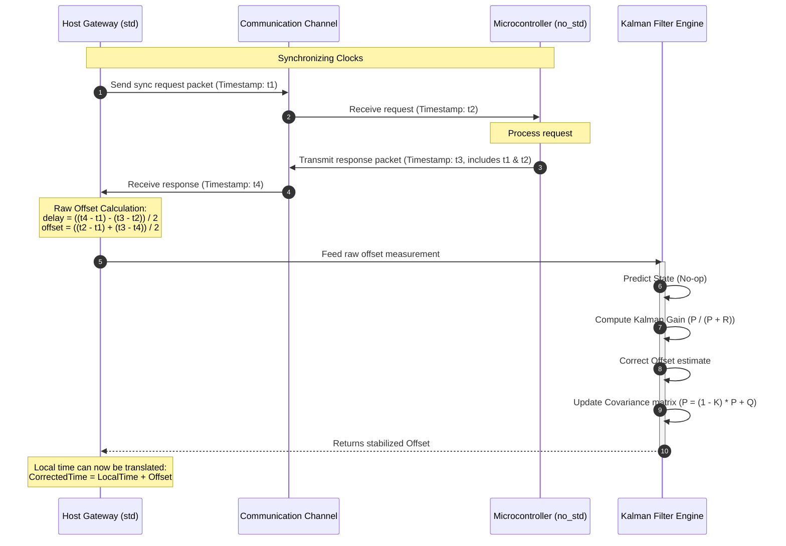
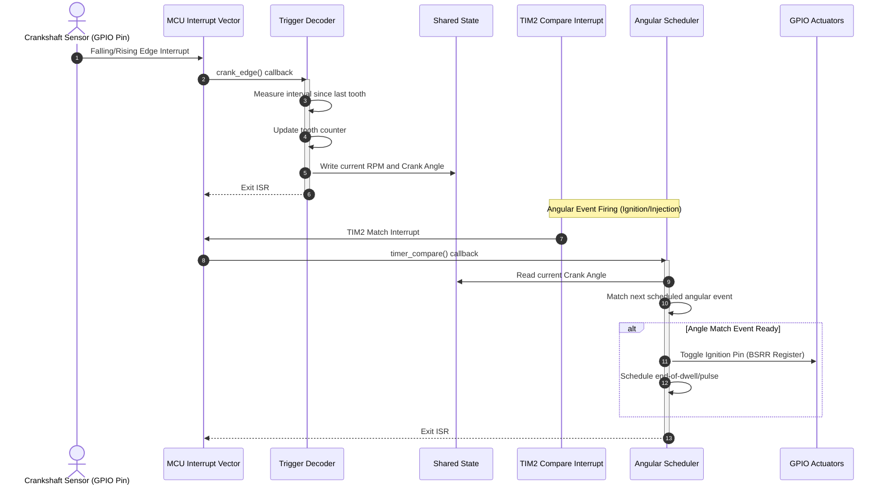
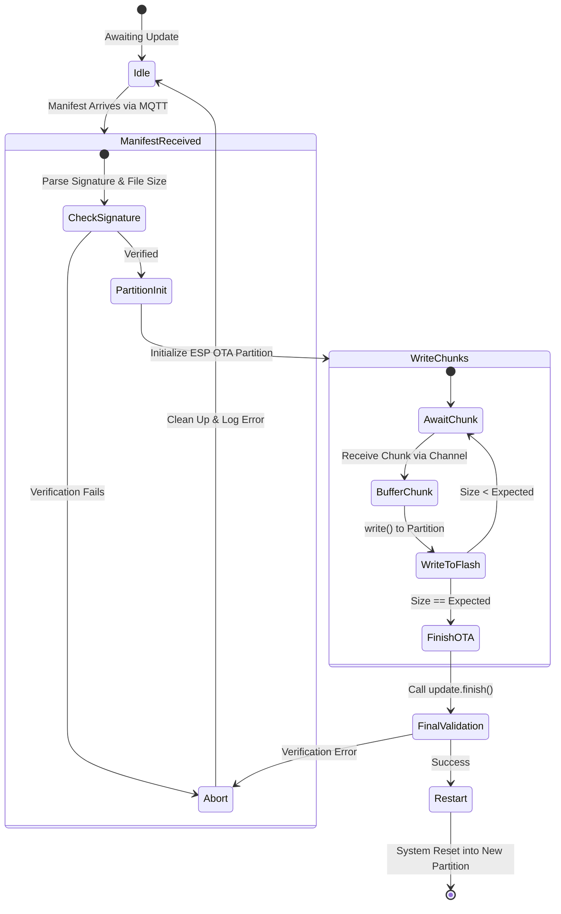

# 📊 Oxide Motive Diagram Collection

This document houses the Mermaid diagram specifications for runtime flows, data pipelines, and network interactions within the Oxide Motive platform.

---

## 1. System Communication Topology

This diagram details the physical and logical layers of the platform, including network boundaries.



---

## 2. PTP Clock Synchronization Sequence

Illustrates the 4-way Network Time Protocol (PTP-like) handshake and the Kalman Filter stabilization block.



---

## 3. Real-Time Telemetry Pipeline

The end-to-end data lifecycle from physical MCU serial reads up to SurrealDB persistence.

```mermaid
gridstrap
    subgraph Data Origin
        MCU_Core[oxide-core: VehicleTelemetry struct]
        Postcard[Postcard Serializer]
        COBS[COBS Encoder]
        MCU_Core -->|Serialize| Postcard
        Postcard -->|Zero-Byte Frame| COBS
    end

    subgraph Gateway Transport
        Serial[oxide-host: Serial Polling Loop]
        CobsDec[COBS Decoder]
        DiskLog[Disk Logger Task]
        SlintChan[Slint HMI Channel]
        
        COBS -->|Raw UART Stream| Serial
        Serial -->|Buffered Bytes| CobsDec
        CobsDec -->|Raw Telemetry String| DiskLog
        CobsDec -->|VehicleTelemetry Struct| SlintChan
    end

    subgraph Ingestion
        CloudBridge[oxide-host: Cloud Publisher]
        ActixAPI[oxide-cloud: Ingestion Endpoint]
        DB[SurrealDB Table]
        
        CobsDec -->|Buffer Ingest| CloudBridge
        CloudBridge -->|HTTP POST JSON Telemetry| ActixAPI
        ActixAPI -->|Async INSERT| DB
    end
```

---

## 4. Angular Scheduler Engine Flow

The sequence of crank sensor interrupt processing and spark ignition event firing.



---

## 5. Over-The-Air Update (OTA) Workflow

Steps to verify signature integrity and safely perform partition transitions.


